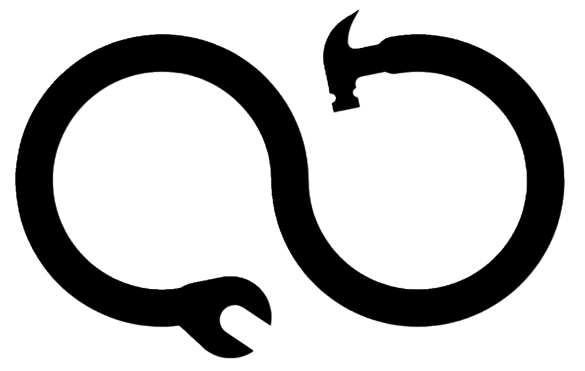

# Kafaa Tools - أدوات كفاءة

<div align="center">
  
  
  ## مجموعة شاملة من الأدوات المجانية للإنتاجية والكفاءة 🚀
  
  [](https://reactjs.org/)
  [](https://www.typescriptlang.org/)
  [](https://vitejs.dev/)
  [](https://tailwindcss.com/)
  [](LICENSE)
</div>

---

## 📋 نظرة عامة

**أدوات كفاءة** هو تطبيق ويب حديث ومتطور يوفر مجموعة شاملة من الأدوات المجانية التي تساعدك في تنفيذ مهامك اليومية بكفاءة وسرعة. جميع الأدوات تعمل في المتصفح مباشرة دون الحاجة لتحميل أي برامج أو التسجيل.

### ✨ المميزات الأساسية

- 🔒 **100% آمن ومحلي** - جميع العمليات تتم في متصفحك
- 🚀 **سريع وحديث** - واجهة مستخدم متجاوبة وسلسة
- 🌐 **متعدد اللغات** - دعم كامل للعربية والإنجليزية
- 📱 **متجاوب** - يعمل على جميع الأجهزة والشاشات
- 🎨 **تصميم عصري** - واجهة جميلة وسهلة الاستخدام
- ⚡ **بدون تسجيل** - استخدم الأدوات مباشرة

---

## 🛠️ الأدوات المتوفرة

### 📄 أدوات المستندات والملفات

| الأداة | الوصف | التقنيات المستخدمة |
|--------|--------|---------------------|
| **📖 قارئ النصوص من الصور (OCR)** | استخراج النصوص من الصور والمستندات بدقة عالية | Tesseract.js, Canvas API |

### 🎨 أدوات الصور والتصميم

| الأداة | الوصف | التقنيات المستخدمة |
|--------|--------|---------------------|
| **🗜️ ضغط الصور** | تقليل حجم الصور مع الحفاظ على الجودة | Browser Image Compression |
| **🎭 إزالة خلفية الصور** | إزالة الخلفية تلقائياً بالذكاء الاصطناعي | Canvas API, Image Processing |
| **🎨 منتقي الألوان** | استخراج وتحليل الألوان من الصور | Canvas API, Color Analytics |
| **🌈 مولد الألوان** | إنشاء لوحات ألوان متناسقة للتصاميم | Color Theory Algorithms |

### 🧮 الحاسبات والأدوات الرياضية

| الأداة | الوصف | التقنيات المستخدمة |
|--------|--------|---------------------|
| **📅 حاسبة العمر الشاملة** | حساب العمر بدقة مع إحصائيات تفصيلية | Date-fns, Advanced Date Calculations |
| **🕐 محول التاريخ الشامل** | تحويل التواريخ بين التقويم الميلادي والهجري | Date-fns, Calendar Conversion |
| **🗺️ حاسبة المسافات** | قياس المسافة بين المدن والإحداثيات | Geolocation API, Haversine Formula |
| **⚖️ حاسبة مؤشر كتلة الجسم** | حساب BMI والوزن المثالي مع توصيات صحية | Health Algorithms |
| **🎓 حاسبة الدرجات والمعدل** | حساب المعدل التراكمي والفصلي للطلاب | GPA Calculation Algorithms |

### � الأدوات العامة والمساعدة

| الأداة | الوصف | التقنيات المستخدمة |
|--------|--------|---------------------|
| **📱 منشئ أكواد QR** | تحويل النصوص والروابط إلى أكواد QR | QRCode.js, QR Code Styling |
| **📷 قارئ أكواد QR** | قراءة وفك تشفير أكواد QR من الصور | HTML5-QRCode, JSQr |
| **🔐 مولد كلمات المرور** | إنشاء كلمات مرور قوية وآمنة | Crypto API, Security Algorithms |
| **📏 محول الوحدات** | تحويل بين وحدات القياس المختلفة | Unit Conversion Algorithms |
| **💱 محول العملات** | تحويل العملات بأسعار الصرف المحدثة | Currency Exchange API |
| **📝 عداد الكلمات والأحرف** | إحصائيات تفصيلية للنصوص مع أوقات القراءة | Text Analysis Algorithms |
| **🔗 فاحص صحة الروابط** | التحقق من حالة المواقع والروابط وقياس سرعة الاستجابة | Fetch API, Performance API |
| **🔒 محول الترميز والتشفير** | تحويل النصوص بين Base64، URL encoding وتنسيقات أخرى | Web Crypto API, Encoding Standards |
| **✂️ تقصير الروابط** | تقصير الروابط وضمان عملها | URL Shortening Algorithms |
| **🔤 مولد ومعاين الخطوط** | معاينة وتجربة الخطوط المختلفة مع تخصيص كامل | Google Fonts API, CSS Font Loading |
| **📋 محرر ومنسق JSON** | تنسيق وتحليل وتحرير ملفات JSON مع التحقق من الصحة | JSON Parser, Syntax Highlighting |
| **🌐 قياس سرعة الإنترنت** | اختبار شامل لسرعة الإنترنت مع قياس التحميل والرفع والاستجابة | Network APIs, Performance Measurement |

---

## 🚀 التقنيات المستخدمة

### Frontend Framework & Core
- **⚛️ React 18.3.1** - مكتبة JavaScript الحديثة للواجهات
- **📘 TypeScript 5.5.3** - للكتابة الآمنة والقوية
- **⚡ Vite 5.4.1** - أداة البناء السريعة
- **🎯 React Router DOM 6.26.2** - التنقل بين الصفحات

### UI Framework & Styling
- **🎨 Tailwind CSS 3.4.11** - إطار عمل CSS متقدم
- **🎭 Framer Motion 12.23.6** - للحركات والانتقالات
- **🧩 Radix UI** - مكونات UI أساسية ومتاحة
- **🎪 Shadcn/ui** - مكونات UI حديثة ومخصصة
- **📊 Recharts 2.15.4** - للرسوم البيانية التفاعلية

### PDF Processing & Documents
- **📄 PDF-lib 1.17.1** - معالجة ملفات PDF
- **📖 PDFjs-dist 5.3.93** - عرض وقراءة PDF
- **💾 jsPDF 3.0.1** - إنشاء ملفات PDF
- **📊 XLSX 0.18.5** - معالجة ملفات Excel
- **📝 Mammoth 1.9.1** - تحويل Word إلى HTML

### Image Processing & Computer Vision
- **🖼️ Browser Image Compression 2.0.2** - ضغط الصور
- **👁️ Tesseract.js 6.0.1** - تقنية OCR المتقدمة
- **🎯 HTML2Canvas 1.4.1** - التقاط لقطات الشاشة
- **🎨 Canvas API** - معالجة الصور المتقدمة

### QR Code & Encoding
- **📱 QRCode 1.5.4** - إنشاء أكواد QR
- **🎨 QR Code Styling 1.9.2** - تخصيص أكواد QR
- **📷 HTML5-QRCode 2.3.8** - قراءة أكواد QR
- **🔍 JSQr 1.4.0** - فك تشفير QR
- **📷 QR Scanner 1.4.2** - مسح أكواد QR

### Data Processing & Utilities
- **📅 Date-fns 3.6.0** - معالجة التواريخ
- **📊 D3.js 7.9.0** - تصور البيانات
- **🗜️ JSZip 3.10.1** - ضغط الملفات
- **🔍 Zod 3.23.8** - التحقق من صحة البيانات

### Form Handling & Validation
- **� React Hook Form 7.53.0** - إدارة النماذج
- **✅ Hookform Resolvers 3.9.0** - التحقق من النماذج
- **🎯 Input OTP 1.2.4** - إدخال رموز التحقق

### Development Tools
- **⚙️ ESLint 9.9.0** - فحص جودة الكود
- **🎨 Prettier** (via Tailwind) - تنسيق الكود
- **🔧 PostCSS 8.4.47** - معالجة CSS
- **📦 Bun** - package manager سريع

### Performance & SEO
- **🏃‍♂️ React Helmet Async 2.0.5** - إدارة SEO
- **📈 TanStack Query 5.56.2** - إدارة حالة الخادم
- **🎨 Next Themes 0.3.0** - دعم الثيمات
- **📊 Web Vitals** - قياس الأداء

### Browser APIs Used
- **📋 Clipboard API** - نسخ ولصق البيانات
- **🌐 Fetch API** - طلبات الشبكة
- **📍 Geolocation API** - تحديد الموقع
- **📱 Web Crypto API** - التشفير
- **💾 Local Storage** - حفظ البيانات محلياً
- **📸 Media Capture API** - الكاميرا والميكروفون
- **🎯 Canvas API** - معالجة الجرافيك
- **⚡ Performance API** - قياس الأداء

**URL**: https://lovable.dev/projects/e9268b73-b941-40bd-8c7c-e8612b44d4f4

---

## 📦 التثبيت والتشغيل

### المتطلبات
- Node.js 18+ أو Bun
- متصفح حديث يدعم ES6+

### خطوات التثبيت

```bash
# استنساخ المشروع
git clone https://github.com/abdallhx2/kafaa-tools.git
cd kafaa-tools

# تثبيت التبعيات باستخدام Bun (الأسرع)
bun install

# أو باستخدام npm
npm install

# أو باستخدام yarn
yarn install
```

### تشغيل المشروع

```bash
# تشغيل البيئة التطويرية
bun dev
# أو
npm run dev

# بناء المشروع للإنتاج
bun run build
# أو
npm run build

# معاينة النسخة الإنتاجية
bun run preview
# أو
npm run preview
```

---

## 🏗️ هيكل المشروع

```
kafaa-tools/
├── public/                 # الملفات العامة
│   ├── logo.png           # شعار التطبيق
│   ├── favicon.ico        # أيقونة المتصفح
│   └── manifest.json      # إعدادات PWA
├── src/
│   ├── components/        # المكونات
│   │   ├── ui/           # مكونات UI الأساسية
│   │   ├── layout/       # مكونات التخطيط
│   │   └── tools/        # أدوات التطبيق
│   ├── hooks/            # React Hooks مخصصة
│   ├── lib/              # المكتبات المساعدة
│   ├── pages/            # صفحات التطبيق
│   ├── utils/            # الأدوات المساعدة
│   └── main.tsx          # نقطة البداية
├── tailwind.config.ts    # إعدادات Tailwind
├── vite.config.ts        # إعدادات Vite
└── package.json          # تبعيات المشروع
```

---

---

## 🤝 المساهمة

نرحب بالمساهمات من الجميع! إليك كيفية المساهمة:

### إضافة أداة جديدة
1. إنشاء مكون جديد في `src/components/tools/`
2. إضافة الأداة إلى `src/pages/Services.tsx`
3. إضافة بيانات SEO في `src/utils/seo-metadata.ts`
4. إضافة المسار في التطبيق الرئيسي

### تحسين أداة موجودة
1. تحديث المكون في `src/components/tools/`
2. إضافة اختبارات إذا أمكن
3. تحديث الوثائق

### الإبلاغ عن الأخطاء
- استخدم GitHub Issues لالإبلاغ عن الأخطاء
- قدم تفاصيل كافية لإعادة إنتاج المشكلة
- أرفق لقطات شاشة عند الإمكان

---

## 📄 الترخيص

هذا المشروع مرخص تحت [رخصة MIT](LICENSE). يمكنك استخدامه وتعديله بحرية.

---

## 🔗 روابط مفيدة

- **🌐 الموقع المباشر**: [kafaa-tools.vercel.app](https://kafaa-tools.vercel.app)
- **📱 تطبيق PWA**: يمكن تثبيته على الهاتف
- **📚 الوثائق**: [docs.kafaa-tools.com](https://docs.kafaa-tools.com)
- **🐛 الإبلاغ عن خطأ**: [GitHub Issues](https://github.com/abdallhx2/kafaa-tools/issues)

---

## 📞 التواصل والدعم

- **📧 البريد الإلكتروني**: support@kafaa-tools.com
- **💬 Discord**: [انضم لمجتمعنا](https://discord.gg/kafaa-tools)
- **🐦 Twitter**: [@KafaaTools](https://twitter.com/KafaaTools)
- **📱 Telegram**: [قناة التحديثات](https://t.me/kafaa_tools)

---

## 🏆 الإحصائيات

<div align="center">
  
  
  
  
  
  
</div>

---

<div align="center">
  
  **صُنع بـ ❤️ في المملكة العربية السعودية**
  
  إذا أعجبك المشروع، لا تنس أن تعطيه ⭐ على GitHub!
  
</div>

---

## How can I edit this code?

There are several ways of editing your application.

**Use Lovable**

Simply visit the [Lovable Project](https://lovable.dev/projects/e9268b73-b941-40bd-8c7c-e8612b44d4f4) and start prompting.

Changes made via Lovable will be committed automatically to this repo.

**Use your preferred IDE**

If you want to work locally using your own IDE, you can clone this repo and push changes. Pushed changes will also be reflected in Lovable.

The only requirement is having Node.js & npm installed - [install with nvm](https://github.com/nvm-sh/nvm#installing-and-updating)

Follow these steps:

```sh
# Step 1: Clone the repository using the project's Git URL.
git clone <YOUR_GIT_URL>

# Step 2: Navigate to the project directory.
cd <YOUR_PROJECT_NAME>

# Step 3: Install the necessary dependencies.
npm i

# Step 4: Start the development server with auto-reloading and an instant preview.
npm run dev
```

**Edit a file directly in GitHub**

- Navigate to the desired file(s).
- Click the "Edit" button (pencil icon) at the top right of the file view.
- Make your changes and commit the changes.

**Use GitHub Codespaces**

- Navigate to the main page of your repository.
- Click on the "Code" button (green button) near the top right.
- Select the "Codespaces" tab.
- Click on "New codespace" to launch a new Codespace environment.
- Edit files directly within the Codespace and commit and push your changes once you're done.

## What technologies are used for this project?

This project is built with:

- Vite
- TypeScript
- React
- shadcn-ui
- Tailwind CSS

## How can I deploy this project?

Simply open [Lovable](https://lovable.dev/projects/e9268b73-b941-40bd-8c7c-e8612b44d4f4) and click on Share -> Publish.

## Can I connect a custom domain to my Lovable project?

Yes, you can!

To connect a domain, navigate to Project > Settings > Domains and click Connect Domain.

Read more here: [Setting up a custom domain](https://docs.lovable.dev/tips-tricks/custom-domain#step-by-step-guide)
